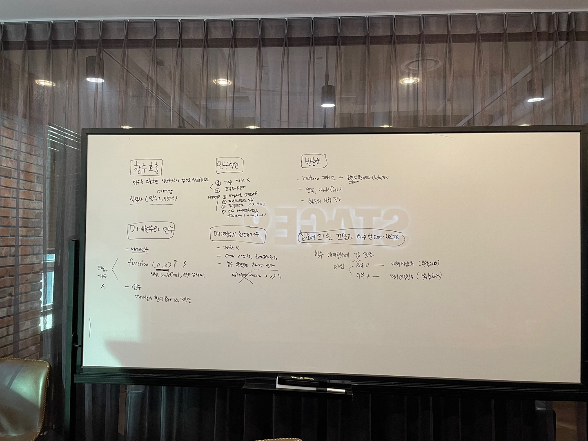

# 12장. 함수 - 2

> 👩‍ 담당자: 황희정 
> 📝 파트: 함수 호출(매개변수와 인수, 인수확인, 매개변수의최대개수, 반환문), 참조에 의한 전달과 외부상태의 변경

# 함수 호출
함수를 호출하면 현재의 실행흐름을 중단하고 호출된 함수로 실행 흐름을 옮긴다.
매개변수에 인수가 순서대로 할당되고,
함수 몸체의 문들이 실행된다.

- 함수를 가리키는 식별자
- 함수 호출 연산자 ( 소괄호 )
- 0개 이상의 인수를 쉼표로 구분해서 나열

### 1) 매개변수와 인수

- 인수
  : 함수를 실행하기 위해 필요한 값을 함수 외부에서 내부로 전달할 경우 매개변수를 통해 인수를 전달한다.
  이때 인수는 값으로 표현할 수 있는 표현식이어야 함
  인수는 개수와 타입에는 제한없음

- 매개변수
  : 함수 몸체 내부에서 변수와 동일하게 취급된다.
  함수가 호출되면 함수 몸체 내에서 암묵적으로 매개변수가 생성되고 undefined로 초기화된 이후 인수가 순서대로 할당된다.
  매개변수는 함수 몸체 내부에서만 참조할 수 있고 외부에서는 참조할 수 없다. (매개변수의 스코프는 함수내부)

- 매개변수의 개수보다 인수의 개수가 부족하다면?
  할당되지 않은 매개변수의 값은 undefined

- 매개변수의 개수보다 인수가 더 많다면?
  초과된 인수는 무시되며, arguments 객체의 프로퍼티로 보관됨

# 인수 확인

올바른 인수가 전달되었는지 확인이 필요하다.

### 이유
1) 자바스크립트 함수는 매개변수와 인수의 개수가 일치하는지 확인하지 않는다.

2) 자바스크립트는 동적타입언어여서, 매개변수의 타입을 미리 지정할 수 없다.

### 인수 확인법
1) typeof 연산자를 통해 옳지않는 인수 타입이라면 throw new Error();로 에러를 발생시킨다.

2) 타입스크립트와 같은 정적타입 언어를 도입

3) 단축평가를 사용해 매개변수에 기본값을 할당한다.

4) ES6에서 도입된 매개변수 기본값을 사용한다.
   인수를 전달하지 않았을때와 undefined를 전달했을 경우에만 유효함.

# 매개변수의 최대 개수 
ECMAScript 사양에서는 매개변수의 최대 개수에 대해 명시적으로 제한하고 있지 않다.
이상적인 매개변수의 개수는 0개이며, 적을수록 좋다.
매개변수의 개수가 많으면 함수가 여러가지 일을 한다는 증거이므로 바람직하지않으며
"함수는 한가지일만 해야하며 가급적 작게 만들어야한다."

# 반환문
return 키워드 + 표현식(반환값) 으로 이루어진 반환문을 사용해 실행 결과를 함수 외부로 반환할 수 있다.

함수 호출 표현식은 return 키워드가 반환한 표현식의 평가결과(반환값)으로 평가된다.

### 반환문의 역할

1) 함수의 실행을 중단하고 몸체를 빠져나간다. 이후의 문을 실행하지않음

2) return 키워드 뒤에 오는 표현식을 평가해 반환한다.

3) 반환문은 생략가능, 생략하면 undefined를 반환

4) 반환문은 함수 몸체 내부에서만 사용할 수 있다.

# 참조에 의한 전달과 외부 상태 변경
함수를 호출하면서 매개변수에 값을 전달하는 방식을
값에 의한 호출 (call by value), 참조에 의한 호출 (call by reference)라고 하며
동작방식은 값에 의한 전달과 참조에 의한 전달과 동일하다.

### 원시 타입 인수 (부수효과 없음)
  원시값은 변경 불가능한 값이므로 값 자체가 복사되어 매개변수에 전달되기 때문에 변경을 해도 원본은 훼손되지 않는다.
  함수외부에서 함수 몸체 내부로 전달한 원시값의 원본을 변경하는 어떠한 부수효과도 발생하지않는다.

### 객체 타입 인수 (부수효과 발생함)
  참조 값이 복사되어 매개변수에 전달되기 때문에 함수 몸체에서 참조값을 변경할 경우 원본이 훼손된다.
  함수 외부(외부 상태)에서 함수 몸체 내부로 전달한 참조값에 의해 원본 객체가 변경되는 부수효과가 발생한다.

> 💡 객체가 변경할 수 있는 값이라 이러한 부작용이 발생한다. (상태 변화를 추적하기가 어려워진다)

### 해결법
1) 옵저버 패턴을 통해 객체 참조를 공유하는 모든 이들에게 변경 사실을 통지하고 이에 대처하는 추가 대응이 필요하다.

2) 객체를 불변 객체로 만들어 사용한다.
   (원복 객체를 깊은 복사하여 새로운 객체를 생성하고 재할당을 통해 교체함- 외부상태가 변경되는 부수효과를 없앨 수 있음)

> 💡 순수 함수: 외부 상태를 변경하지 않고 외부 상태에 의존하지도 않는 함수
